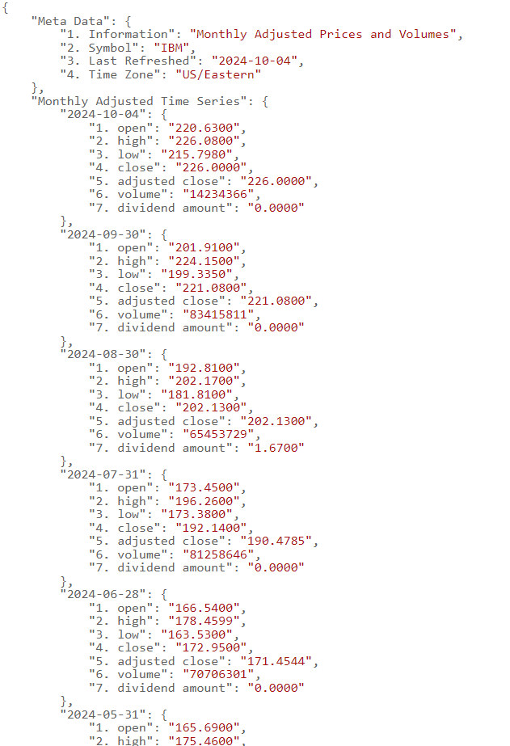
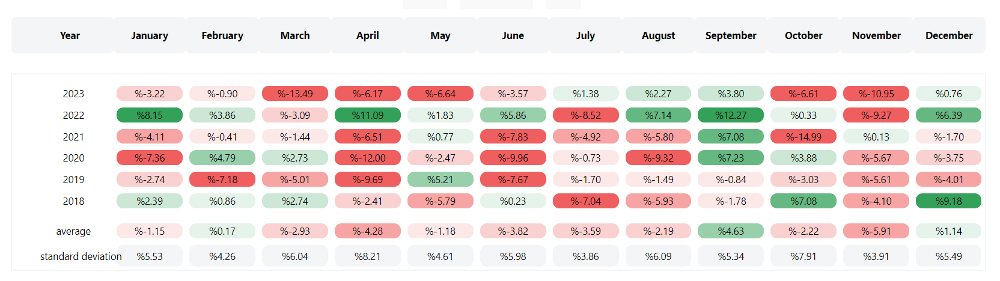
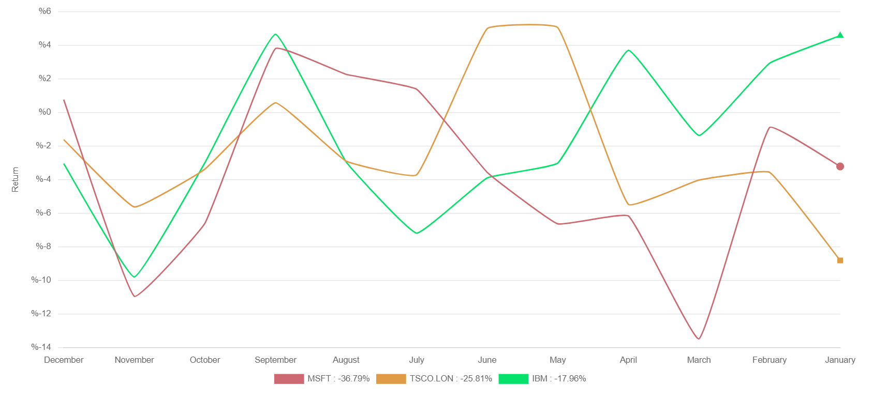

 **Introduction**

In this project, we have developed a Stock Analysis Application using React.js, designed to fetch, process, and visually display stock performance data for selected companies.

The application allows users to view historical stock data for multiple companies, calculate important financial metrics (such as monthly returns and annual returns), and present the information in both tabular and chart formats.

We used modern libraries and techniques such as :

- react-chartjs-2 for interactive charts, 
- Tailwind CSS for responsive styling,  
- the Alpha Vantage API for fetching stock data.


For the purpose of this project, three demo stocks (**MSFT**, **TSCO.LON**, and **IBM**) are used.

This decision was made due to the limitations on non-demo stocks, which are restricted to a maximum of 25 API calls per day.

By using demo stocks, the application can function without hitting those restrictions during testing and development.

**What We Did in This Project**

- Component-based Architecture
We built the application using React's component-based approach to create reusable and maintainable code.

- The key components developed include:


1. **StockTable Component**: Displays historical stock data and calculated returns in a table format.


1. **StockChart Component**: Renders an interactive line chart to show stock performance over time using ```react-chartjs-2```.


1. **StockDetail Component**: Manages the app's state, handles data loading, and coordinates the table and chart components.


**Data Fetching and API Integration**: 
We used the Alpha Vantage API to fetch historical stock data.

The ```fetchStockData``` and ```fetchFilteredData``` functions were created to handle the API requests, format the data, and filter it by date range (e.g., 2018–2023) because the raw data isnt useful for our project. you can see apart of **IBM** raw data below. 




Implemented caching to minimize repeated API calls and improve performance by storing previously fetched stock data.


**Stock Data Calculation**: 
We wrote utility functions to process the stock data into a format suitable for display in both tables and charts.


 This included: 
- **Monthly Returns Calculation**:
 We calculated the percentage return for each month based on stock prices.


- **Annual Returns Calculation**: 
By using monthly returns, we computed the compounded annual returns to provide a summary of stock performance over each year.


- **Average and Standard Deviation**: Calculations for average monthly returns and standard deviation of returns were also implemented to provide further insights.


**Data Visualization** :
- Using react-chartjs-2, we visualized the stock performance over time in a line chart.

- Different companies are represented by different colors and shapes, and the chart includes custom plugins for additional visual tweaks like padding and point styles.


- The table was built using React, and it displays stock performance metrics in a user-friendly format with calculated values for each month and year.


- Responsive Design with Tailwind CSS 
The application is fully responsive, thanks to Tailwind CSS. It adapts seamlessly to different screen sizes, ensuring a consistent user experience on both desktop and mobile devices.


**User Interaction**:
- Users can select between multiple stock symbols (e.g., MSFT, TSCO-LON, IBM) to view detailed performance data.

- The data and charts dynamically update when the selected stock changes


- We added error handling and loading states to ensure that the app provides feedback while fetching data or when an error occurs during API requests


>**Summary**
>>- This project showcases the combination of React.js for front-end development, Chart.js (via ```react-chartjs-2```) for data visualization, Alpha Vantage API for stock data retrieval, and Tailwind CSS for responsive design.<br/>
>>- The application provides users with a way to analyze and compare historical stock performance with visual charts and tables, using modern web development techniques to ensure interactivity, performance, and ease of use.

<br>
<br>


**Project Structure**
project is organized as follows: 
- **src/**:Contains all React components, styles, and utility functions.


- **components/**: Contains individual component files for StockTable, StockChart, and StockDetail.


- **App.js**: The main application file that combines components.


### Component Breakdown :


 #### 1. StockTable Component :
```js
import "../App.css"; 
import { useState, useMemo } from 'react';
import { useTable } from "react-table";
function StockTable(props) {
  return <Table data={props.stockData} />;
};
```


<br/>


- **```import "../App.css"```;** 

**Purpose:** This line imports the CSS file App.css, which contains global styles for the application.


**Effect**: It applies the CSS rules defined in ```App.css``` to all components in the application, including ```StockTable```.

>This ensures that any custom styles in that file are applied to the component.


Note: The relative path ```(../)``` indicates that the CSS file is located one directory level .above the current file.


- **```import { useState, useMemo } from 'react'```;**

**Purpose:** This line imports```useState``` and ```useMemo```, two hooks from the core React library that are necessary for handling state and optimizing performance in the component.


- **```useState```:**
   
A hook that allows us to add state to my function component.we can use ```useState``` to track variables such as user interactions, component data, or other dynamic values.


- **```useMemo```:** 
  
A hook that memoizes values or computations, so they are only recalculated when necessary (i.e., when dependencies change).It is used to optimize performance, especially in expensive operations.

<br/>

>In the ```StockTable``` component, ```useMemo``` is typically used to memoize the columns configuration or computed data for the table, ensuring that the table re-renders only when necessary, thus improving performance.


<br/>


- **```import { useTable } from "react-table"```;**
  
***Purpose***: This line imports the ```useTable``` hook from the ```react-table``` library, which is essential for creating tables with customizable columns and rows.


**```useTable```**: 
It is a powerful hook that provides the logic needed to structure and render a table in React.

It handles: 
Table headers and rows Sorting, filtering, pagination, etc.


This hook gives us the tools to create tables in a declarative manner with control over each part of the table (rows, headers, cells).


- **```function StockTable(props) {```**
  
**Purpose:** This is the declaration of the ```StockTable``` functional component.

It accepts ```props``` as an argument, which is a standard way in React to pass data from a parent component to a child component.


  **Props:** The ```props``` object contains all the data passed to ```StockTable```, including the ```stockData``` that will be displayed in the table.


>In the context of this project: The parent component of ```StockTable``` will provide the stock market data through ```props.stockData```.


<br/>

  - **```return <Table data={props.stockData} />```;**
Purpose: This line renders another component called ```Table``` and passes the stock data (```props.stockData```) as a prop to it.


<br/>

- **Table**: The actual implementation of the ```table``` is abstracted to another component (```Table```).
<br/> 

```StockTable``` acts as a wrapper or high-level component responsible for passing the necessary data to the ```Table``` component.


**```data={props.stockData}```**: The ```stockData``` prop is passed down from ```StockTable``` to ```Table```, where it will be used to populate the table rows.


<br/>


```
const Table = (props) => {  const columns = useMemo(() => [    { Header: "Year", accessor: "year" },    //...

other columns
  ], []);
  
```

**Table Function**: Defines the main table logic.

<br/>

**```Columns```**: Uses ```useMemo``` for performance optimization, defining the structure of the table with headers and accessors corresponding to data fields.

<br/>

**```const { getTableProps, getTableBodyProps, headerGroups, rows, prepareRow } = useTable({ columns, data: props.data });```**

It is a key part of the ```react-table``` library, which is widely used in React applications for creating highly customizable tables.

>Here’s a detailed breakdown of what this line does: 
>>```useTable``` Hook Overview 
>>```useTable```: A hook that returns various properties and methods for table management, including props for the >> 
>>```table``` and row preparation.
>>```columns```: This is the structure of  table.
>>>It defines the headers, the data fields they represent, and any other information (like sorting, filtering, etc.).
>>```data```: This is the array of data objects that will populate my table.
>>Each object represents a row in my table, with keys corresponding to the column accessors.
>>**Destructured Variables fro```useTable```**
When we call ```useTable```, it returns a number of functions and objects that help in rendering and managing the table.
>>>Here's what each of these destructured variables does: 
>>>>```getTableProps```
Purpose: This function returns props that are necessary to apply to the root ```<table>``` element for the table to function correctly.
>>>>Usage: It typically provides accessibility and other table-specific attributes, such as ```role="table"```.
>>>>Example Usage:  
>>>>```<table {...getTableProps()}>  {/* Table headers and body go here */}</table>```
>>>>```getTableBodyProps``` 
Purpose: Similar to ```getTableProps```, but specifically for the ```<tbody>``` element.
>>>>>It ensures that any attributes or event handlers required by the ```tbody``` are applied.
>>>>Example Usage:
>>>>```<<tbody {...getTableBodyProps()}>< {/* Rows go here */}</tbody>```
>>>>```headerGroups``` 
>>>>Purpose: This array contains all the header groups that my table has.
>>>>>Each ```headerGroup``` includes information for rendering the header rows.
>>>>>Structure: Each ```headerGroup``` contains an array of headers that can be mapped to create the ```<th> ```elements for each column.
>>>>Example Usage:
```
<{headerGroups.map(headerGroup => (  <tr {...headerGroup.getHeaderGroupProps()}>    {headerGroup.headers.map(column => (      <th {...column.getHeaderProps()}>        {column.render('Header')}
      </th>
    ))}
  </tr>
))}

```
>>>>>Here, each header group can be rendered in a ```<tr>``` tag with multiple ```<th>``` tags, one for each column in the header group.
>>```rows``` 
Purpose: This is an array containing all the data rows in my table.
>>>Each ```row``` object represents a single row of my table and includes the necessary information to render each cell.
>>>Usage: The ```rows``` array can be mapped over to create the actual table rows (```<tr>``` elements) in my table body.


>>>>Example Usage:
```
{rows.map(row => {
  prepareRow(row);
  return (
    <tr {...row.getRowProps()}>
      {row.cells.map(cell => (
        <td {...cell.getCellProps()}>
          {cell.render('Cell')}
        </td>
      ))}
    </tr>
  );
})}
```
>>>```prepareRow``` 
Purpose: This function is called for each row before rendering it.
>>>>It applies necessary properties like ```onClick``` handlers, accessibility attributes, and styles to each row
Usage: It must be called for every row before it is rendered in the ```rows.map()``` loop.

<br/>

- **Hover State Management with** ```useState``` 

```const [hoveredHeaderGroupIndex, setHoveredHeaderGroupIndex] = useState(null); 
const [hoveredRowIndex, setHoveredRowIndex] = useState(null); 
const [hoveredColumnIndex, setHoveredColumnIndex] = useState(null); 
```

**Purpose**: These three ```useState``` hooks are used to track which part of the table (header, row, or column) is being hovered over.


- **```hoveredHeaderGroupIndex```**: Tracks which column header is currently being hovered.


- **```hoveredRowIndex```**: Tracks which row is being hovered.


- **```hoveredColumnIndex```**: Tracks which column in the table body is being hovered.


By tracking these states, we can dynamically apply styles (like highlighting the header, row, or column) when the user moves their mouse over specific areas of the table.


 **JSX Structure of the Table**


```
return (
  <div className="App relative">
    <div className="container table-container">
      <table {...getTableProps()} className="custom-table table fixed-table items-center w-full text-black">
```


**Purpose**: This block represents the layout and rendering logic for the table structure in JSX.


- **```getTableProps()```**: This method comes from the ```useTable``` hook from the ```react-table``` library.It provides all necessary props (like ```aria-*```, ```role```, ```style```, etc.) required to render a table that conforms to accessibility and table standards.
  <br/>


- **CSS Classes**: Custom Tailwind CSS classes (```custom-table```, ```fixed-table```, etc.) are applied for styling the table and controlling layout, width, text color, etc.


**Table Header Rendering** 

```
<thead className="p-3 items-center w-full border-2 border-black rounded-lg head-layout">
  {headerGroups.map((headerGroup, headerGroupIndex) => (
    <tr {...headerGroup.getHeaderGroupProps()} className="p-3 items-center w-1/12 cell-margin rounded-md border-b">
      {headerGroup.headers.map((column, index) => (
        <th
          onMouseEnter={() => setHoveredHeaderGroupIndex(index)}
          onMouseLeave={() => setHoveredHeaderGroupIndex(null)}
          {...column.getHeaderProps()}
          className={`p-3 text-center text-sm table-container w-1/12 column-${index} 
            ${hoveredColumnIndex !== 0 && hoveredColumnIndex === index ? 'hovered' : ''}
            ${hoveredHeaderGroupIndex !== 0 && hoveredHeaderGroupIndex === index ? 'hovered' : ''}
            ${index === 0 ? 'first-header-th' : ''}
            ${index === headerGroup.headers.length - 1 ? 'last-header-th' : ''}`}
        >
          {column.render("Header")}
        </th>
      ))}
    </tr>
  ))}
</thead>
```

**Purpose**: This block handles the rendering of the table header.


- **```headerGroups```**: Comes from ```useTable```, it contains groups of headers (useful in cases where there are multi-level headers).


**Hover Events**: 
When the user hovers over a header (```onMouseEnter```), the corresponding ```index``` is set to ```hoveredHeaderGroupIndex```.

<br/>
When the user stops hovering (```onMouseLeave```), the ```hoveredHeaderGroupIndex``` is reset to ```null```.

<br/>
This allows for dynamic highlighting of headers as the user interacts with them.
<br/>

**Dynamic Classes:** 
The dynamic classes (e.g., ```${hoveredColumnIndex === index ? 'hovered' : ''}```) apply specific styles when a header or column is hovered.<br/>

**Example:** The ```hovered``` class is conditionally applied when the current column is being hovered.
<br/>


 **Table Body Rendering**

 ```
 <tbody {...getTableBodyProps()} className="p-3 cell-margin bg-white">
  {rows.map((row, rowIndex) => {
    prepareRow(row);
    return (
      <tr
        {...row.getRowProps()}
        className={`${hoveredRowIndex === rowIndex ? 'hovered-row' : ''}`}
        onMouseEnter={() => setHoveredRowIndex(rowIndex)}
        onMouseLeave={() => setHoveredRowIndex(null)}
      >
        {row.cells.map((cell, columnIndex) => (
          <td
            {...cell.getCellProps()}
            className="w-1/12 p-[4px]"
            onMouseEnter={() => setHoveredColumnIndex(columnIndex)}
            onMouseLeave={() => setHoveredColumnIndex(null)}
          >
            <div className={`${getCellColorClass(cell.value, cell)} padding-cell rounded-lg 
              ${columnIndex === 0 && hoveredRowIndex === rowIndex ? "year-hover" : ''}
              ${hoveredColumnIndex == 0 && hoveredRowIndex !== rowIndex ? 'hoveredd' : ''}
              ${hoveredHeaderGroupIndex !== null && hoveredHeaderGroupIndex !== columnIndex ? 'hoveredd' : ''}`}
            >
              {cell.column.Header !== "Year" ? `%${cell.value}` : cell.render("Cell")}
            </div>
          </td>
        ))}
      </tr>
    );
  })}
</tbody>
```


**Purpose:** This block renders the body of the table.


- **```rows```:** Represents the rows of data, which are dynamically generated based on the ```props.data``` passed to the component.


- **```prepareRow(row)```:** A function from ```useTable``` that prepares the row data and ensures that proper props are added for rendering.


**Dynamic Hovering:**

Just like the table headers, the rows and cells are also interactive.


When the user hovers over a row (```onMouseEnter```), the ```hoveredRowIndex``` state is set, which triggers a CSS class (```hovered-row```) to style the row.


Similarly, hovering over columns (```hoveredColumnIndex```) allows individual columns to be highlighted.


- **```getCellColorClass```:** This function is applied to each cell to determine its color class based on the cell's value.

It ensures that cells are color-coded based on their data.


**Table Footer with Averages and Standard Deviation**


```
<tfoot className="mt-4 cell-margin p-3">
  <tr>
    {columns.map((column) => {
      const averageRow = props.data.find(item => item.year === "average");
      const averageValue = averageRow ? averageRow[column.accessor] : "";
      return (
        <td key={column.accessor} className="padding-cell p-[4px] rounded-lg">
          <div className={`${getCellColorClass(averageValue, { column })} padding-cell rounded-lg`}>
            {averageValue !== "average" ? `%${averageValue}` : "average"}
          </div>
        </td>
      );
    })}
  </tr>
  <tr>
    {columns.map((column) => {
      const standardDeviationRow = props.data.find(item => item.year === "standard deviation");
      const standardDeviationValue = standardDeviationRow ? standardDeviationRow[column.accessor] : "";
      return (
        <td key={column.accessor}>
          <div className={`rounded-lg p-[4px] ${standardDeviationValue !== "standard deviation" ? 'hovereddd' : ''}`}>
            {standardDeviationValue !== "standard deviation" ? `%${standardDeviationValue}` : "standard deviation"}
          </div>
        </td>
      );
    })}
  </tr>
</tfoot>
```


**Purpose:** This block renders the footer, where calculated data such as "average" and "standard deviation" are displayed.


- **Average and Standard Deviation:** These values are derived from ```props.data```.

The ```averageRow``` and ```standardDeviationRow``` are found by looking for rows where ```year``` equals "average" or "standard deviation".


**Dynamic Rendering:** If a value exists, it is displayed with the format ```"%${value}"```, otherwise it shows either "average" or "standard deviation".


**CSS Classes:** Hover effects (```hovereddd```) are applied similarly to the body and header, allowing for interactive styling.


**Explanation of Each Code Block 
Table Setup:**
The table is structured using ```getTableProps()``` to ensure that all table-wide attributes are applied.


- **Headers:** For each header group, the ```getHeaderGroupProps()``` is applied to the ```<tr>```.

- Inside each ```<tr>```, we iterate over the headers and use ```getHeaderProps()``` to ensure each ```<th>``` has the right properties.

- The actual column name is rendered using ```column.render('Header')```.


- **Rows and Cells:** 
For each row in the ```rows``` array, we first call ```prepareRow(row)``` to attach necessary props and behaviors.


- Each row renders its cells inside ```<td>``` tags, where we apply ```getCellProps()``` to ensure each cell has the right attributes, and ```cell.render('Cell')``` is used to render the cell’s content.



> **Summary** 
>>- This code implements a dynamic, responsive table with the ability to track and visually highlight hovered rows, columns, and headers.
>>- The table is built using ```react-table```, with custom styles applied through Tailwind CSS and additional logic for hover interactions.
>>- Hover states for headers, rows, and columns are managed using ```useState```, and styling is dynamically applied based on these states.
>>- Footer rows are added to display averages and standard deviations, calculated from the table data, and hover effects are also applied here.

<br/>


2. **StockChart Component** 
The ```StockChart``` component in my project is designed to display a stock chart using the ```react-chartjs-2``` library, which leverages ```Chart.js``` for creating a variety of charts in a React application.

This specific implementation focuses on rendering a line chart for stock data, showing stock symbols and their corresponding annual returns.

Below is a detailed breakdown of the code and its functionalities: 

 - **Import Statements** 

 ```
 import { Line } from "react-chartjs-2";
import { Chart, registerables } from 'chart.js';
```


**Purpose:** These import statements bring in the necessary libraries and components to create the chart.


- **```Line```:** This is the React wrapper for the ```Line``` chart from Chart.js, used to create the line graph.


- **```Chart``` and ```registerables```**: These are core components of Chart.js.

```registerables``` includes essential elements like scales, legends, and tooltips that need to be registered with Chart.js.


- **Registering Chart.js Components** 

```
Chart.register(...registerables);

```

**Purpose:** This line registers all the necessary components from ```Chart.js``` to ensure that the line chart can be rendered correctly with features like axes, legends, and tooltips.

Without this registration, Chart.js would not have access to the necessary elements to create and display the chart.


**Custom Legend Padding Plugin**

```
const legendPaddingPlugin = {
  id: 'legendPadding',
  beforeInit(chart) {
    const originalFit = chart.legend.fit;
    chart.legend.fit = function () {
      originalFit.call(chart.legend);
      this.height += 50; // Adjust this value for more or less space
    };
  }
};


```

**Purpose:** This custom plugin adjusts the padding around the chart's legend, providing extra space between the legend and the chart.


- **```beforeInit(chart)```:** Hooks into the chart initialization process.


- **Custom ```fit()```:** Overrides the default fitting function for the legend, adding 50 pixels of additional padding to improve the visual layout.


**Defining Line Styles with pointStyles** 

```
const pointStyles = ['circle', 'rect', 'triangle', 'cross', 'line'];

```

**Purpose:** This array defines different shapes (```circle```, ```rect```, etc.) for the points on each line of the chart.

Each dataset (stock) can have a different point shape to distinguish it visually on the chart.


**Generating the Chart's Datasets**

```
const datasets = props.stockDataList.map((item, index) => {
  const isTSCO = item.symbol === "TSCO-LON";
  const annualReturn = item.annualReturns[0] ? item.annualReturns[0].annualReturn : 0;

  const dataEntries = Object.entries(item.calcData[0]).slice(1);
  const lastIndex = dataEntries.length - 1;

  return {
    label: `${item.symbol} : ${annualReturn}%`,
    data: dataEntries,
    fill: false,
    borderColor: getColorByIndex(index),
    tension: 0.1,
    pointRadius: dataEntries.map((_, idx) => (idx === lastIndex ? 5 : 0)),
    pointStyle: isTSCO && index === datasets.length - 1 ? 'rect' : pointStyles[index % pointStyles.length],
    backgroundColor: getColorByIndex(index),
    pointHoverRadius: 5,
    showLine: true,
  };
});

```

**Purpose:** This block generates the datasets for the chart based on the stock data passed in via ```props```.


- **```item.symbol```:** The stock symbol (e.g., "TSCO-LON") is displayed in the legend.


- **```item.annualReturns[0]```:** The annual return percentage is displayed next to the stock symbol.


- **```dataEntries```:** Represents the actual data points for the stock's performance.

These are sliced to exclude the first entry (typically a label or a year).


- **```borderColor```:** The color of the line for each stock, determined by the ```getColorByIndex``` function.


- **```pointRadius```:** Shows the last point on the line with a larger radius (5), while all other points are hidden (```0```).


- **```pointStyle```:** Uses custom point shapes, with special handling for the "TSCO-LON" stock.


- **```showLine```:** Ensures that lines are drawn even if there are only a few data points.


**Rendering the Line Chart **

```
<Line
  data={{ datasets: datasets }}
  options={{
    parsing: { xAxisKey: '[0]', yAxisKey: '[1]' },
    scales: {
      x: { grid: { display: false } },
      y: {
        grid: { display: true, drawBorder: false },
        ticks: { display: true, callback: (value) => `%${value}`, padding: 10 },
        title: { display: true, text: 'Return', padding: { top: 10 } },
        border: { display: false }
      }
    },
    elements: { line: { borderWidth: 2 } },
    plugins: {
      legend: { position: 'bottom', padding: 50 }
    },
    hover: {
      mode: 'index',
      intersect: false
    }
  }}
  plugins={[legendPaddingPlugin]}
/>

```

**Purpose:** This block renders the actual line chart with all the configurations.


- **Data:** The ```datasets``` generated in the previous step are passed into the ```Line``` component.


- **Options:**
```scales```: Configures the x and y axes: 
The x-axis does not display grid lines (```display: false```).


The y-axis displays grid lines but without a border (```drawBorder: false```).


- **Custom Tick Labels:** Y-axis values are shown as percentages (```callback: (value) =>``` %${value}).


- **```legend```:** Positioned at the bottom with additional padding.


- **```hover```:** Configures hovering behavior so that hovering over a point highlights all data points for that specific index (x-axis).


- **Custom Plugin:** The ```legendPaddingPlugin``` is applied to add padding between the legend and the chart.


**Color Utility Function**

```
const getColorByIndex = (index) => {
  switch (index) {
    case 0: return '#cd6a71';
    case 1: return '#e09b47';
    case 2: return '#05e26b';
    case 3: return '#5c33fe';
    case 4: return '#36cd84';
    default: return '#000'; // Fallback color
  }
};

```

**Purpose:** This function assigns a unique color to each dataset based on its index.

It provides visual distinction between multiple lines on the chart.


- **```switch (index)```:** A different color is returned for each dataset (line).

If there are more than 5 datasets, it falls back to black (```#000```).





>Summary 
>>The ```StockChart``` component is a well-structured React component that dynamically creates and renders a line chart based on stock data passed through ```props```.


>>The use of ```react-chartjs-2``` and ```Chart.js``` allows for powerful, customizable charting with features like interactive hover states, custom point styles, and dynamic legends.


>>The custom ```legendPaddingPlugin``` is used to control the padding between the chart and the legend, enhancing the visual layout.


>>Hover states are configured to highlight corresponding data points across the chart, and the y-axis is formatted to display values as percentages.


>>The datasets are built dynamically, with each ```dataset``` representing a stock's performance, including special handling for the "TSCO-LON" stock.


StockDetail Component 

The ```StockDetail``` component is the main container that coordinates fetching stock data, performing calculations, and rendering both the stock table and chart components.

The following sections break down each part of the code and explain its purpose and functionality.


Import Statements 

```
import "../App.css";
import { useState, useEffect, useMemo } from 'react';
import StockChart from './StockChart';
import StockTable from './StockTable';
import { fetchFilteredData } from '../repo/DataRepo';
import { calculateStockDataForTable } from '../utils/StockCalc';

```

Purpose: These import statements pull in the required modules and files.


```App.css```: CSS file for styling the component.


```useState, useEffect, useMemo```: React hooks used to manage state, handle side effects, and optimize calculations.


```StockChart``` & ```StockTable```: Child components that display the stock data in different formats (chart and table).


```fetchFilteredData```: A utility function to fetch stock data for a specific time range.


```calculateStockDataForTable```: A utility function to process and format the stock data for display in the table.


State Management 

```

const allSymbols = ["MSFT", "TSCO.LON", "IBM"];
const [selectedSymbol, setSelectedSymbol] = useState(allSymbols[0]);
const [stockData, setStockData] = useState([]);
const [loading, setLoading] = useState(true);
const [error, setError] = useState(null);

```

Purpose: Manages component state.


```allSymbols```: An array of stock symbols for Microsoft (```MSFT```), Tesco (```TSCO.LON```), and IBM (```IBM```).

These are the stocks that will be displayed.


```selectedSymbol```: Tracks the currently selected stock symbol for display.

Initially set to the first symbol in ```allSymbols``` (Microsoft).


```stockData```: Holds the stock data fetched for all the symbols.


```loading```: Tracks whether data is being fetched (```true```) or has finished loading (```false```).


```error```: Holds any errors encountered during data fetching.


Fetching Stock Data 

```
const getDataFromRepo = async (symbol) => {
  return { symbol: symbol, list: await fetchFilteredData(symbol, 2018, 2023) };
};

const loadData = async () => {
  setLoading(true);
  const allStocksData = await Promise.all(allSymbols.map((symbol) => getDataFromRepo(symbol)));
  setLoading(false);
  if (allStocksData.every((item) => item.list !== null)) {
    setStockData(allStocksData);
  } else {
    setError('Failed to fetch stock data');
  }
};

```


```getDataFromRepo(symbol)```: Fetches stock data for a specific symbol from the ```DataRepo``` module for the years 2018–2023.


Returns an object containing the symbol and its corresponding stock data.


```loadData()```:Initiates the data fetching process by setting ```loading``` to ```true```


Fetches stock data for all symbols using ```Promise.all()```, which allows multiple async operations to run concurrently.


If data fetching is successful (```allStocksData.every((item) => item.list !== null)```), the state variable ```stockData``` is updated with the fetched data.


If there’s an error, it sets the ```error``` state with a failure message.


 useEffect Hook 

 ```
 useEffect(() => {
  loadData();
}, []);

```

Purpose: The ```useEffect``` hook ensures that ````loadData()```is called once when the component first mounts.

This is how the stock data is initially fetched when the user opens the application.


Handling Loading and Error States 

```
if (loading) return <p>Loading...</p>;
if (error) return <>
  <p>{error}</p>
  <button onClick={() => loadData()}>Reload</button>
</>;

```

Loading State: If the ```loading``` state is ```true```, a loading message is displayed


Error State: If there’s an error (```error !== null```), it displays the error message and provides a button to retry loading the data by calling ```loadData()``` again.


Calculating Data for Display 

```
const calculatedDataList = stockData.map((data) => {
  const dataForTable = calculateStockDataForTable(data.list);
  return { symbol: data.symbol, calcData: dataForTable.returns, annualReturns: dataForTable.annualReturns };
});

```
Purpose: This code processes the fetched stock data to calculate the necessary data for both the table and the chart.


```calculateStockDataForTable(data.list)```: This function processes the stock data to extract the necessary values for displaying returns and annual returns.


The result is an array of objects where each object contains: 
```symbol```: The stock symbol.


```calcData```: Calculated return data to be displayed in the table.


```annualReturns```: Annual return percentages for the stock.


Rendering the Component 

```
return <div className="container mx-auto ">
  <div className="flex-col lg:flex-row space-y-4 lg:space-y-0 lg:space-x-4">
    {allSymbols.map((item) => {
      return <button onClick={() => setSelectedSymbol(item)} className="open && 'bg-gray-100'...">
        {item}
      </button>;
    })}
    <div className="space-y-0.5">
      <div className="flex-1">
        <StockTable stockData={calculatedDataList.find((item) => item.symbol === selectedSymbol).calcData} />
      </div>
      <div>
        <StockChart stockDataList={calculatedDataList} className="flex-1" />
      </div>
    </div>
  </div>
</div>;

```

Rendering the Buttons: 

```allSymbols.map((item) => <button ...>{item}</button>)```: This loop creates a button for each stock symbol.

When clicked, it updates the ```selectedSymbol``` state to display data for the clicked stock.


Rendering the Stock Table: 

```StockTable stockData={calculatedDataList.find((item) => item.symbol === selectedSymbol).calcData}```: The ```StockTable``` component is rendered, passing the calculated table data for the currently selected stock.


Rendering the Stock Chart: 

```StockChart stockDataList={calculatedDataList}```: The ```StockChart``` component is rendered, passing the full list of calculated data for all stocks.


Summary 

The ```StockDetail``` component orchestrates the following: 

Fetching stock data for predefined symbols (```MSFT```, ```TSCO.LON```, and ```IBM```) from a remote source using the ```fetchFilteredData``` function.


Handling loading and error states, ensuring that the UI is responsive to the status of data fetching.


Processing the stock data into a format suitable for display in both a table and a chart using the utility function ```calculateStockDataForTable```.


Rendering a dynamic user interface with buttons to switch between stocks, a table to display detailed stock data, and a chart to visualize the stock performance.


The component makes use of React hooks (```useState```, ```useEffect```), async functions for data fetching, and conditional rendering to handle different states (loading, error, or displaying data).


DataRepo  
Stock Data Fetching and Filtering Functions 

 covers the implementation of two JavaScript functions, ```fetchStockData``` and ```fetchFilteredData```, which are used to fetch stock market data from the Alpha Vantage API and filter it based on a specific time range.

The functions also implement basic caching to avoid redundant API calls for the same data.


 Alpha Vantage API URL Construction 

 ```
 const stockUrl = (symbol) => `https://www.alphavantage.co/query?function=TIME_SERIES_MONTHLY_ADJUSTED&symbol=${symbol}&apikey=demo`;

```
Purpose: The ```stockUrl``` function dynamically constructs the URL to access the Alpha Vantage API, specifically the TIME_SERIES_MONTHLY_ADJUSTED function, which provides historical stock prices on a monthly basis.


```symbol```: The stock ticker symbol passed to the function, e.g., "MSFT" for Microsoft


```apikey=demo```: The API key required to access Alpha Vantage, though this uses a demo key.


Caching Mechanism 

```
const cachedData = {};

```

Purpose: This object acts as a simple in-memory cache to store previously fetched data.

It helps avoid making repeated API calls for the same stock symbol and improves the efficiency of the function.


Why Caching Matters: 
API rate limits: Alpha Vantage, like many APIs, has a rate limit for how frequently we can make requests, especially with a demo key


Performance: Fetching stock data from an external API can be slow, so caching ensures that data for previously requested stocks is instantly available without waiting for the response.


Fetching Stock Data 
```
const fetchStockData = async (symbol) => {
  try {
    if (cachedData[symbol]) {
      return cachedData[symbol];
    }
    const response = await fetch(stockUrl(symbol));
    const data = await response.json();
    if (!data["Monthly Adjusted Time Series"]) { 
      throw "data format error";
    }
    cachedData[symbol] = data;
    return data;
  } catch (err) {
    console.log(err);
  }
  return null;
};

```

Explanation: 
Input: Takes a stock ticker symbol (e.g., "AAPL" for Apple) as an argument.


Caching Check: 
If the requested data for the stock symbol already exists in ```cachedData```, the function immediately returns that cached data.


This reduces redundant API calls and ensures faster responses on subsequent requests for the same stock.


Fetching Data: 
If the data is not cached, the function constructs the API URL using ```stockUrl(symbol)``` and makes an HTTP request using the ```fetch``` API.


The response is parsed as JSON (```response.json()```), and the function checks if the data contains the "Monthly Adjusted Time Series" key, which holds the stock price data.


Error Handling: 
If the data does not contain the expected structure, the function throws an error: ```"data format error"```.


All errors, including potential network issues, are caught in the ```catch``` block, and the error is logged to the console.


Return Value: 
On success, the fetched stock data is stored in the cache (```cachedData[symbol]```) and returned.


If an error occurs or if the data is invalid, the function returns ```null```.


Summary: 
Caching improves performance and API usage efficiency.


Error Handling prevents the application from breaking due to unexpected issues, such as network failures or incorrect data formats.


Filtering Stock Data by Year 

```
const fetchFilteredData = async (symbol, startYear, endYear) => {
  try {
    const data = await fetchStockData(symbol);
    const dataListed = Object.entries(data["Monthly Adjusted Time Series"]);
    return dataListed.filter((item) => {
      const year = new Date(item[0]).getFullYear();
      return year >= startYear && year <= endYear;
    });
  } catch (err) {
    console.log(err);
  }
  return null;
};

```


Explanation: 
Input: Takes three arguments: 
```symbol```: The stock ticker symbol for which data is being requested.


```startYear```: The start of the date range for filtering.


```endYear```: The end of the date range for filtering.


Fetching Data: 
Calls ```fetchStockData(symbol)``` to get the stock data for the specified symbol, which may come from the cache or the API.


Converts the "Monthly Adjusted Time Series" data into an array using ```Object.entries()```.

 This transforms the data into an array of key-value pairs where: 
The key is the date (e.g., "2023-09-30").


The value is the stock data for that month.


Filtering Data by Year: 
```filter()```: Iterates over the data and filters it based on the year.


```new Date(item[0]).getFullYear()```: Extracts the year from the date string (```item[0]```).


The function checks whether the year is between the specified ```startYear``` and ```endYear```.


Error Handling: 
As in ```fetchStockData```, any errors during data fetching or filtering are caught and logged to the console.


If an error occurs, the function returns ```null```.


Summary: 
The ```fetchFilteredData``` function provides a convenient way to request stock data for a specific time range, ensuring that only relevant data is returned.


It combines data fetching, caching, and filtering into a single step, making it easier to work with stock data in different parts of an application.


Exporting the Functions 

```
export { fetchStockData, fetchFilteredData };

```
Purpose: Both ```fetchStockData``` and ```fetchFilteredData``` are exported so that they can be used in other parts of the application.

This modular structure allows developers to fetch stock data in different contexts, whether they need the full dataset or just a filtered subset.


Overall Functionality 
API Integration: 
Both functions integrate with the Alpha Vantage API to fetch stock market data, using a demo API key.


Data Caching: 
Caching is implemented to minimize unnecessary API calls, improving the efficiency and speed of the application.


Error Handling: 
Both functions include basic error handling mechanisms to log and handle errors gracefully without breaking the application.


Data Filtering: 
The ```fetchFilteredData``` function allows filtering of stock data by a specific year range, ensuring only the relevant data is processed.


Reusability: 
These functions are modular and reusable, making them flexible for different scenarios in stock data analysis applications.

They can be used for generating stock performance reports, visualizations, or comparisons.


StockCalc 

```calculateStockDataForTable``` Function 

Purpose of the Function 
The ```calculateStockDataForTable``` function is designed to process stock data and compute various metrics that can be displayed in a table, such as: 
Monthly Returns: Calculates percentage returns for each month.


Averages: Computes the average return for each month across the years.


Standard Deviation: Calculates the standard deviation of monthly returns across the years.


Annual Returns: Computes the overall annual return for each year based on the monthly returns.


The processed data is then structured in a format suitable for display in a stock table.


 Breakdown of the Process 
 Initializing the Returns Array 

```
let returns = [];

```

Purpose: This array will hold the monthly returns for each year.

Each entry in the array represents a year and its corresponding monthly returns.


 Iterating Over the Stock Data 

 ```
 for (let i = 0; i < data.length; i++) {
  const year = new Date(data[i][0]).getFullYear();
  const month = new Date(data[i][0]).toLocaleString('default', { month: 'long' });
  if (!returns.some((item) => item.year === year)) {
    returns.push({ year: year });
  }

```


Explanation: 
The loop iterates through the stock data, which is a list of key-value pairs where each key is a date and the value is the stock information for that month.


The function extracts the year and month from the data.


It checks if the ```returns``` array already contains data for the current year.

If not, it adds a new object representing that year.


Calculating Monthly Returns 

```
const returnPercent = ((Number(previousMonth["5.

adjusted close"]) - Number(currentMonth["5.

adjusted close"])) / Number(currentMonth["5.

adjusted close"])) * 100;

```
Explanation: 
The percentage return for each month is calculated as: 

Return = $\frac{(Previous Month’s Close − Current Month’s Close)}{Current Month’s Close} *100$​ 


The result is stored as the percentage ```return``` for the specific month and year in the returns array.


Storing the Last Month's Return 

```
if (i + 1 >= data.length) {
  const returnPercent = ((Number(currentMonth["5.

adjusted close"]) - Number(currentMonth["1.

open"])) / Number(currentMonth["1.

open"])) * 100;
  returns.find((item) => item.year === year)[month] = returnPercent.toFixed(2);
}
```

Explanation: 
When the loop reaches the last month, the function computes the return as the percentage change between the opening price and the adjusted closing price for that month.


Calculating Averages for Each Month 

```
Calculating Averages for Each Month

```


Purpose: This block computes the average monthly return across all years for each month.


Explanation: 
For each month, the function adds up the returns across all years.


After summing the returns, it divides by the number of years to get the average.


The result is formatted to two decimal places.


Calculating Standard Deviation for Each Month 

```
const sd = { year: "standard deviation" };
returns.forEach((item) => {
  for (const i in item) {
    if (i !== "year") {
      sd[i] = (sd[i] || 0) + Math.pow(Number(item[i]) - av[i], 2);
    }
  }
});
for (const m in sd) {
  if (m !== "year") {
    sd[m] = Math.sqrt(sd[m] / (returns.length - 1)).toFixed(2);
  }
}

```

Purpose: This block computes the standard deviation of monthly returns across the years.


Explanation: 
The standard deviation is calculated by finding the squared difference between each monthly return and the average monthly return, then taking the square root of the average of these squared differences.


 Calculating Annual Returns 

 ```
 const annualReturns = returns.map((item) => {
  const months = Object.keys(item).filter((key) => key !== 'year');
  const annualReturn = months.reduce((acc, month) => {
    const monthValue = parseFloat(item[month]);
    return acc * (1 + monthValue / 100);
  }, 1) - 1;
  return {
    year: item.year,
    annualReturn: (annualReturn * 100).toFixed(2)
  };
});

```

Purpose: This block calculates the overall annual return for each year by compounding the monthly returns.


Explanation: 
The formula used to calculate the annual return is: 

AnnualReturn = $ \prod_{i=1}^{12} (  1 + \frac{{Monthly Return}_i}{100} )$ - 1 


This compound interest-like calculation gives the total annual return based on the monthly percentage changes.


The result is formatted as a percentage and stored in the ```annualReturns``` array.


Final Data Structure 

```
returns.push(av);
returns.push(sd);
return { returns: returns, annualReturns: annualReturns };

```

Purpose: After calculating the monthly returns, averages, standard deviations, and annual returns, the function returns an object containing: 
```returns```: An array of yearly data with monthly returns, averages, and standard deviations


```annualReturns```: An array of annual returns for each year.


 Summary of Key Outputs 
Monthly Returns: The function calculates percentage returns for each month over multiple years


Averages: It computes the average monthly return for each month across all years


Standard Deviation: It calculates the standard deviation of the monthly returns for each month


Annual Returns: It computes the overall return for each year by compounding the monthly returns.


